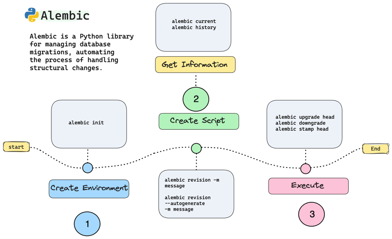
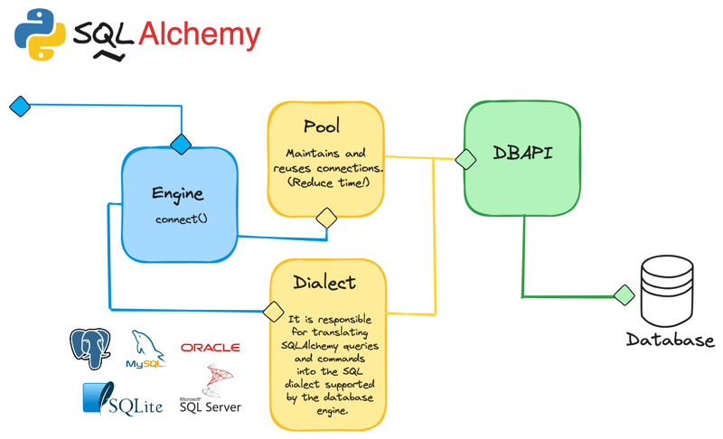

# Setup new project

1. [x] python -m venv venv
2. [x] venv\Scripts\activate
3. [x] pip install fastapi uvicorn pydantic[dotenv] alembic

# **Project structure:**

### 1. Structuring based on File-Type
### 2. **References**:

* https://fastapi.tiangolo.com/tutorial/bigger-applications/
* https://medium.com/@amirm.lavasani/how-to-structure-your-fastapi-projects-0219a6600a8f

        ├── app  # Contains the main application files.
        │   ├── __init__.py   # this file makes "app" a "Python package"
        │   ├── main.py       # Initializes the FastAPI application.
        │   ├── dependencies.py # Defines dependencies used by the routers
        │   ├── routers
        │   │   ├── __init__.py
        │   │   └── user.py  # Defines routes and endpoints related to user.
        │   ├── crud
        │   │   ├── __init__.py
        │   │   └──  user.py  # Defines CRUD operations for user.
        │   ├── schemas
        │   │   ├── __init__.py
        │   │   └──  user.py  # Defines schemas for authors.
        │   ├── models
        │   │   ├── __init__.py
        │   │   └──  user_models.py  # Defines database models for user.
        │   ├── external_services
        │   │   ├── __init__.py
        │   │   └──  aws.py  # Defines functions for s3_service.
        │   └── utils
        │       ├── __init__.py
        │       └── user_type_enum.py  # Defines functions for user.
        ├── tests
        │   ├── __init__.py
        │   └── test_users.py  # Tests for the authors module.
        ├── requirements.txt
        ├── .gitignore
        └── README.md

# Technologies

## 1.Alembic

1. [x] Alembic is a 🐍Python library that enables controlled and automated database migrations. This library utilizes SQLAlchemy and it allows for the management of changes in the database schema through scripts, which describe the modifications and can be applied automatically.
2. [x] Reference:
    - https://dev.to/r0mymendez/simplify-database-migrations-using-python-with-alembic-4bhd
    - https://medium.com/@johnidouglasmarangon/using-migrations-in-python-sqlalchemy-with-alembic-docker-solution-bd79b219d6a

1. `alembic current`: Displays the current version of the database.
2. `alembic history`: Lists all created migrations.
3. `alembic heads`: Shows versions that have not been applied yet.
4. `alembic show <version>`: Displays the content of a specific migration.
5. `alembic upgrade <version>`: Upgrades the database to a specific version.
6. `alembic downgrade <version>`: Reverts the database to a specific version.
7. `alembic stamp <version>`: Stamps the database with a version without running the migration.
8. `alembic revision --autogenerate -m "your message"`: Automatically generates a migration script with a custom message.

## 2.SQLAlchemy
1. [x] SQLAlchemy is a 🐍 python library that implements ORM and allows you to perform different actions on a related database.
2. [x] Reference: 
   - https://dev.to/r0mymendez/simplify-database-migrations-using-python-with-alembic-4bhd
   - https://medium.com/@johnidouglasmarangon/using-migrations-in-python-sqlalchemy-with-alembic-docker-solution-bd79b219d6a
### _Main Components_

   * SQLAlchemy Core
   * SQLAlchemy ORM

### _The following are the key components of SQLAlchemy to understand how it interacts with the database:_

   
   * `Engine`: It is the interface that allows interaction with the database. It handles connections and executes queries. (`create_engine`).
   * `Pool`: It is a collection of connections that allows reusing connections and improving query performance by reducing time.
   * `Dialect`: It is the component that allows interaction with the database. Each dialect is designed to interact and translate queries for a database; By default, this library has dialects for MySQL, MariaDB, PostgreSQL, SQL Server, and Oracle. But there are external dialects, in which you should import other libraries.
   * `DBAPI`: It is the interface that provides methods to enable communication between Python and the database.
   * Session: An object that manages communication between Python and the database, handling transactions and executing SQL commands.
   * Declarative Base: A way to define tables using ORM. Each table is defined as a Python class (`Base = declarative_base()`).

## 3.Pydantic
- Pydantic is a Python library for data validation and settings management using Python type annotations. It ensures data integrity by parsing and validating input data.