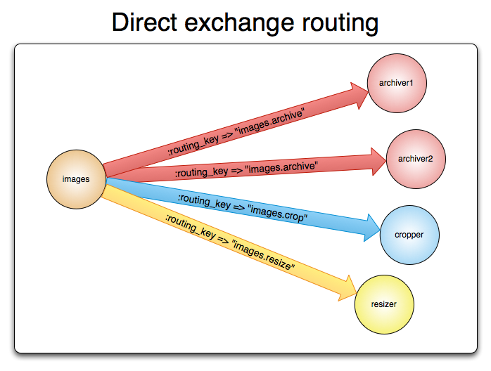
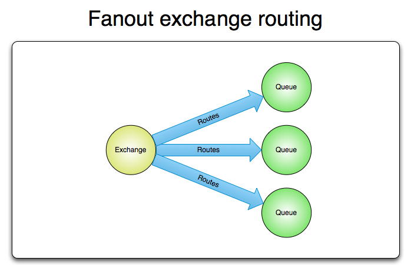

# RabbitMQ

## References:
1. [x] https://www.rabbitmq.com/tutorials
2. [x] https://viblo.asia/p/tim-hieu-ve-rabbitmq-OeVKB8bMlkW

## 1. Khái niệm
- `RabbitMQ là một message-queuing software có thể được biết đến như là một người vận chuyển message trung gian hoặc một người quản lí các queue.`
- `Vậy, tại sao chúng ta phải cần đến RabbitMQ? Hãy tưởng tượng, hiện bạn đang có một web service, phải nhận rất rất nhiều request mỗi giây, mà lại phải đảm bảo rằng không có bất cứ một request nào bị mất. Và web service của bạn luôn luôn sẵn sàng tiếp nhận request mới thay vì locked bởi đang xử lí request trước đó. Vậy ý tưởng ở đây là đặt chúng vào một queue giữa web service và processing service. Lúc này sẽ đảm bảo rằng 2 process sẽ hoàn toàn tách rời nhau. Ngoài ra, queue sẽ lưu trữ những request, không bị thiếu sót request nào khi số lượng của chúng trở nên vô cùng lớn.`

## 2. Những khái niệm cơ bản trong RabbitMQ
1. [x] `Producer`: Ứng dụng gửi message.
2. [x] `Consumer`: Ứng dụng nhận message.
3. [x] `Queue`: Lưu trữ messages.
4. [x] `Message`: Thông tin truyền từ Producer đến Consumer qua RabbitMQ.
5. [x] `Exchange`: Là nơi nhận message được publish từ Producer và đẩy chúng vào queue dựa vào quy tắc của từng loại Exchange. Để nhận được message, queue phải được nằm trong ít nhất 1 Exchange.
6. [x] `Binding`: Đảm nhận nhiệm vụ liên kết giữa Exchange và Queue.
7. [x] `Routing` key: Một key mà Exchange dựa vào đó để quyết định cách để định tuyến message đến queue. Có thể hiểu nôm na, Routing key là địa chỉ dành cho message.
8. [x] `AMQP`: Giao thức Advance Message Queuing Protocol, là giao thức truyền message trong RabbitMQ.
9. [x] `User`: Để có thể truy cập vào RabbitMQ, chúng ta phải có username và password. Trong RabbitMQ, mỗi user được chỉ định với một quyền hạn nào đó. User có thể được phân quyền đặc biệt cho một Vhost nào đó.

## 3. Các thành phần trong RabbitMQ

1. [x] `Broker`: Thành phần chính của RabbitMQ, chịu trách nhiệm nhận, lưu trữ, và gửi tin nhắn.
2. [x] `Connection`: Một kết nối TCP giữa ứng dụng và RabbitMQ broker.
3. [x] `Channel`: Một kết nối ảo trong một Connection. Việc publishing hoặc consuming từ một queue đều được thực hiện trên channel.
4. [x] `Virtual Host (vHost)`: Cung cấp những cách riêng biệt để các ứng dụng dùng chung một RabbitMQ instance. Những user khác nhau có thể có các quyền khác nhau đối với vhost khác nhau. Queue và Exchange có thể được tạo, vì vậy chúng chỉ tồn tại trong một vhost.
5. [x] `Plugin`: RabbitMQ hỗ trợ nhiều plugin như management plugin (giao diện quản lý), Shovel, và Federation.

## 3. Các loại Exchange

### 3.1 Direct Exchange

- Tin nhắn được định tuyến đến queue dựa trên sự trùng khớp chính xác của routing key.
- Routing key từ tin nhắn phải khớp chính xác với binding key của hàng đợi
- Các bước định tuyến message:

     1. [x] Một queue được ràng buộc với một direct exchange bởi một routing key K.
     2. [x] Khi có một message mới với routing key R đến direct exchange. Message sẽ được chuyển tới queue đó nếu R=K.

### 3.2 Default Exchange
- Là một Direct Exchange đặc biệt, được RabbitMQ cung cấp mặc định.
- Không có tên exchange (tên rỗng: "").
- Routing key phải trùng khớp chính xác với tên của hàng đợi.
- Không cần khai báo hay cấu hình trước.
- Ví dụ, nếu bạn tạo ra 1 queue với tên "hello-world", RabbitMQ broker sẽ tự động binding default exchange đến queue "hello-word" với routing key "hello-world".

### 3.3 Fanout Exchange

- Tin nhắn được gửi đến tất cả các hàng đợi liên kết (binding) với exchange, bỏ qua routing key.
- Phù hợp khi cần phát broadcast (phát thông tin tới mọi hàng đợi).

### 3.4 Topic Exchange
- Tin nhắn được định tuyến tới các hàng đợi dựa trên routing key dạng mẫu (pattern).
- Routing key sử dụng `.` để phân tách, và các mẫu hỗ trợ ký tự đại diện:
  1. [x] `*`: Đại diện cho một từ.
  2. [x] `#`: Đại diện cho nhiều từ (hoặc không có từ nào).
- Ví dụ một vài trường hợp sử dụng:
  
   1. [x] Phân phối dữ liệu liên quan đến vị trí địa lý cụ thể.
   2. [x] Xử lý tác vụ nền được thực hiện bởi nhiều workers, mỗi công việc có khả năng xử lý các nhóm tác vụ cụ thể.
   3. [x] Cập nhật tin tức liên quan đến phân loại hoặc gắn thẻ (ví dụ: chỉ dành cho một môn thể thao hoặc đội cụ thể).
   4. [x] Điều phối các dịch vụ của các loại khác nhau trong cloud

### 3.5 Headers Exchange
Tin nhắn được định tuyến dựa trên giá trị của các header properties, không dựa trên routing_key
Cần cấu hình headers và x-match:
   1. [x] `x-match=all`: Tất cả các giá trị header phải khớp.
   2. [x] `x-match=any`: Chỉ cần một giá trị header khớp.